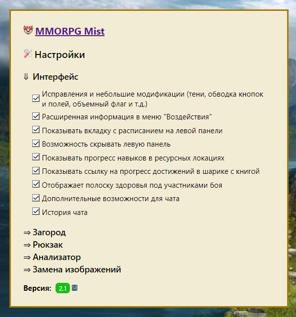
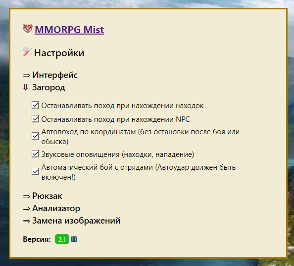
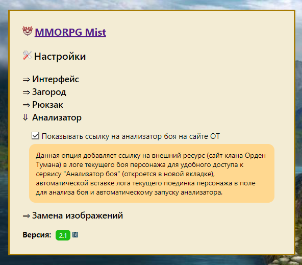
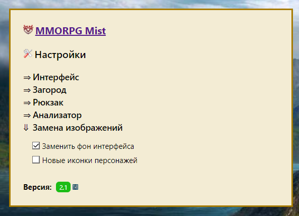
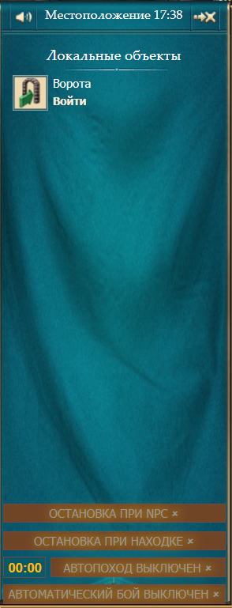
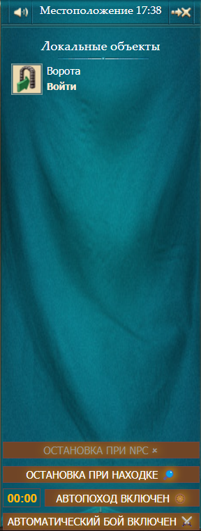
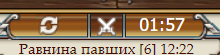
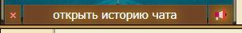

<h2>Установка расширения в Google Chrome/Opera/Firefox браузерах</h2>

1. Скачиваем .zip архив https://github.com/bordugnet/mist-game-extensions-for-browsers/releases/tag/mist-game-extensions-for-browsers
2. Распаковываем содержимое архива в любой каталог на компьютере
3. В браузере в новой вкладке открываем [chrome://extensions/](chrome://extensions/)
4. В правом верхнем углу включаем режим разработчика
5. Жмем кнопку "загрузить распакованное расширение"
6. Указываем папку с распакованным архивом
7. Жмем открыть, перезагружаем мист, наслаждаемся, отслеживаем баги
8. Для открытия расширения:

Основные настройки расширения:
1. Настройки интерфейса
   

2. Настройки загорода

3. Включен анализатор боя от сайт клана Орден Тумана

4. Замена изображений

Меню интерфейса:

1. ОСТАНОВКА ПРИ NPC
Персонаж автоматически делает остановки при нахождении любого НПС("Отряд духов", "Отряд разбойников", "Чернокнижник Рейн", "Копьеносец Мил", "Привал торговцев", "Святилище Чарги", "Сандор", "Юсуф ибн Омар", "Несокрушимый Горт", "Пьяные горожане", "Потерянный горожанин", "Отряд витов").
2. ОСТАНОВКА ПРИ НАХОДКЕ
Персонаж автоматически делает остановки при нахождении любой находки ("Большой схрон", "Схрон", "Куча листьев", "Звериная нора", "Сухое дерево", "Куча хвороста", "Гнездо")
3. АВТОПОХОД
Персонаж выполняет поход по рандомным координатам, в поле указывются координаты куда он должен дойти сам (не зависимо будет бой или нет, без остановок кроме если включены кнопки"ОСТАНОВКА ПРИ NPC" или "ОСТАНОВКА ПРИ НАХОДКЕ") при НПС будет остановка как и при обнаружении находки. В противном случае будет продолжен поход до указанных в поле координат. По достижению заданных координат, будет задан новый маршрут похода автоматически.
4. АВТОМАТИЧЕСКИЙ БОЙ
При данном режиме персонаж будет сам вступать в бой (духи, разбойники) если совершенно нападение. При данном режиме должен быть включен режим автоудара()
5. Меню расширения чата 
Кнопка 
 включает/отключает звук если персонаж нашел находку (для ввода каптчи или взаимодействия с НПС), кнопка 
 служит для очистки истории чата, так как он хранится в кеш браузера и постоянно загружается заново при заходе в игру. Самоочистка происходит при достижении 5000 сообщений.

ДЕМОНСТРАЦИЯ
https://jumpshare.com/share/tXdjbjB0JhJLYP6LyedN
